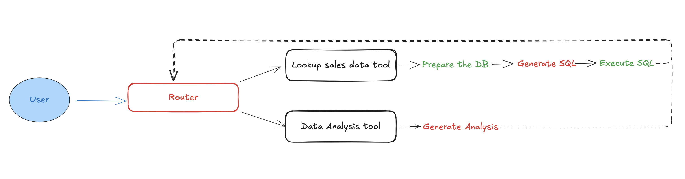

# Database-analysis-agent

In this notebook we will be building an agent that is comprised of a router using OpenAI function calling, and a set of three tools: a database lookup tool, a data analysis tool, and a code generator to create graphs.

The goal of this notebook is :

- Show how to build an agent with code
- Trace the agent
- Run evals
- Improve the agent performance
